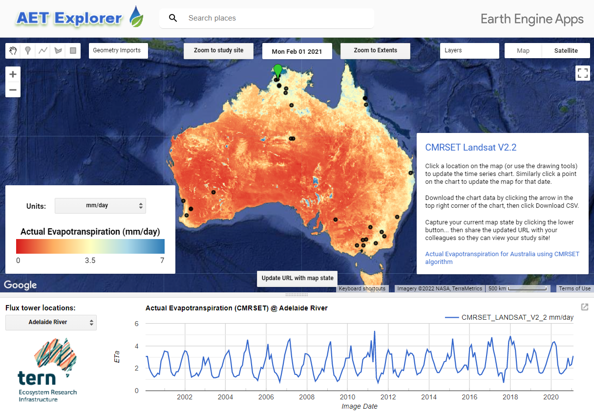

## CMRSET Code Examples

The CMRSET Landsat V2.2 data product provides accurate, high-resolution (30 m) / high-frequency (monthly) / continuous (no gaps due to cloud) actual evapotranspiration (AET) for Australia using the CMRSET algorithm.

This repository provides code examples of how you can access the data. The product has been made available to users via two methods:
1. <a href="https://portal.tern.org.au/actual-evapotranspiration-australia-cmrset-algorithm/21915" target="_blank">TERN Data Services (TDS)</a>  
   The data on TDS is provided as <a href="https://www.cogeo.org/" target="_blank">Cloud-Optimized GeoTIFF's</a> which can be downloaded over the web.  Each monthly image (~16 GB) has been divided into 12 smaller tiles (< 4 GB each) to make downloading easier (i.e if your study site fits within one tile you can just download that tile rather than the whole of Australia). A <a href="https://gdal.org/drivers/raster/vrt.html" target="_blank">VRT</a> file (virtual dataset) has also been provided for each month to mosaic the 12 tiles back to a complete Australian image.  
     

2. <a href="https://developers.google.com/earth-engine/datasets/catalog/TERN_AET_CMRSET_LANDSAT_V2_2" target="_blank">Google Earth Engine (GEE)</a>  
   The data on GEE is provided as an <a href="https://developers.google.com/earth-engine/guides/ic_creating" target="_blank">Image Collection</a>, whereby each monthly asset within the collection represents the whole of Australia. Using GEE, your analysis can benefit by the easy integration of the vast number of other datasets available within the <a href="https://developers.google.com/earth-engine/datasets" target="_blank">Earth Engine catalog</a>. Similarly, you may also export data from GEE as <a href="https://www.cogeo.org/" target="_blank">Cloud-Optimized GeoTIFF's</a> (to Goole Drive, or Google Cloud Storage) as you will discover from these examples.  
     

### Additional data access options

If your use case for accessing CMRSET ET data is really simple, you may also be interested in the <a href="https://tern-landscapes.earthengine.app/view/cmrset-landsat-v22" target="_blank">AET Explorer</a>. This web tool will allow you to either click points/draw polygons on the map in your web browser to extract CSV data... You can also choose your desired units as well!!

