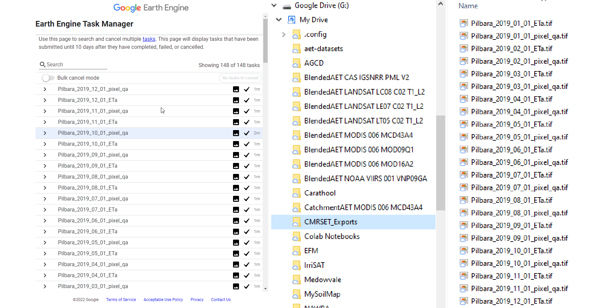

## Google Earth Engine Code Examples

These code examples demonstrate how you can access the <a href="https://developers.google.com/earth-engine/datasets/catalog/TERN_AET_CMRSET_LANDSAT_V2_2" target="_blank">CMRSET Landsat</a> actual evapotranspiration data product via the <a href="https://earthengine.google.com/" target="_blank">Google Earth Engine</a> catalog.

The code examples are implemented in both:
1. **Python** - can be run in the cloud via , in the form of <a href="https://jupyter.org/" target="_blank">Jupyter Notebooks</a>
2. **Javascript** - can be run in the cloud via the <a href="https://developers.google.com/earth-engine/guides/playground" target="_blank">Earth Engine Code Editor</a>

The Python/Javascript implementations of the Earth Engine API are near identical (hence so are the examples)...  So choose your preferred flavour!

To run these examples it is assumed you have <a href="https://signup.earthengine.google.com/#!/" target="_blank">registered</a> to Google Earth Engine. Please feel free to adapt these examples to meet your own requirements.

### Example 1 - CMRSET Long-Term Average ET (Temporal Aggregation)

")
This example illustrates how to access the CMRSET Landsat V2.2 data product via Earth Engine and compute the long-term average evapotranspiration for a section of the Lachlan River. Finally the result is exported to <a href="https://www.google.com/drive/" target="_blank">Google Drive</a> as a <a href="https://www.cogeo.org/" target="_blank">Cloud-Optimised GeoTIFF</a>.

**Execution Time:** ~8 minutes  
**Storage Required:** 55 MB (on Google Drive)

---

### Example 2 - Aggregating CMRSET for a set of Features (Spatial Aggregation)

")
This example illustrates how to compute the average evapotranspiration for a set of features (such as a multi-polygon/multi-point set). In this example we will use the Australian World Herritage Sites (which cover land) as our feature set. The monthly timeseries for each feature is then exported as a CSV to <a href="https://www.google.com/drive/" target="_blank">Google Drive</a>.

**Execution Time:** ~8 minutes  
**Storage Required:** 16 kB (on Google Drive)

---

### Example 3 - Unpacking the CMRSET QA Band

This example illustrates how to uppack the <a href="https://developers.google.com/earth-engine/datasets/catalog/TERN_AET_CMRSET_LANDSAT_V2_2#bands" target="_blank">CMRSET QA band</a>. The CMRSET QA band contains 4 pieces of extra information for each pixel which may further assist with your analysis. These 4 pieces of information are: the source of the data; condensation adjustment; the number of Landsat observations used for this pixel; and whether the pixel value was derived from Landsat SLC-Off data.

**Execution Time:** Real-time  
**Storage Required:** Nil

---

### Example 4 - Exporting the Image Stack for a Region

This example illustrates how to export the CMRSET Landsat V2.2 imagery via Earth Engine for a study area in the Pilbara. Both ETa and QA bands are exported. We will also illustrate changing the <a href="https://developers.google.com/earth-engine/guides/projections" target="_blank">projection</a> of the exported images to <a href="https://epsg.io/4283" target="_blank">GDA94</a> (EPSG:4283). This example can potentially generate gigabytes of data, so we demonstrate two different methods for exporting the data to suit your own storage capabilities. These methods are:

1. **Via Google Drive** - This method is the simplest, however you may not be prepared to pay for a monthly subscription to upgrade your Google Drive storage limits if your export exceeds the free storage teir (20 GB).

2. **Via Google Cloud Storage** - This method can incur a once-off fee (rather than a subscription) for the egress costs associated with downloading the imagery from Google Cloud Storage. This method is recommended when method 1) is not appropriate for your circumstances.

**Execution Time:** ~3 minutes  
**Storage Required:** 172 MB (on Google Drive or Google Cloud Storage)

---

