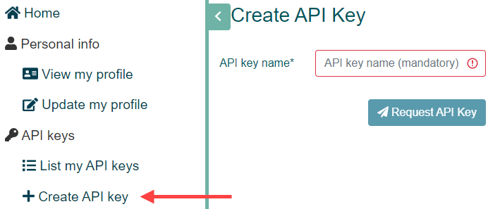

 

## TERN Data Services Code Examples

These examples demonstrate how to download the CMRSET Actual Evapotranspiration products from the TERN Data Services Catalogue as <a href="https://www.cogeo.org/" target="_blank">Cloud-Optimized GeoTIFF's</a>.
These scripts are effictively *"bots"* which will scrape the online data archive for you (to save you clicking on links). 
We're also interested in building *robots* to distribute herbs too... they will help pass the thyme!

The two implementations we provide here are:

1. **PowerShell:** a cross-platform task automation solution made up of a command-line shell, a scripting language, and a configuration management framework.
    <a href="https://docs.microsoft.com/en-us/powershell/scripting/overview?view=powershell-7.2" target="_blank">PowerShell</a> runs on Windows, Linux, and macOS.
    Windows PowerShell also comes <a href="https://docs.microsoft.com/en-us/powershell/scripting/windows-powershell/install/installing-windows-powershell?view=powershell-7.2" target="_blank">installed by default</a> in every Windows, starting with Windows 7 SP1 and Windows Server 2008 R2 SP1.

2. **Python:** an interpreted, object-oriented, high-level programming language with dynamic semantics.
    This makes <a href="https://en.wikipedia.org/wiki/Python_(programming_language)" target="_blank">Python</a> very attractive for Rapid Application Development, as well as for use as a scripting or glue language to connect existing components together. 
    This is why it's sometimes also referred to as the *"universal language for data science"*.
    Python also runs on Windows, Linux, and macOS.

Note: the Python implementation is also provided as a docker container. Please refer to the Python readme for more information.

### Script Parameters

The following parameters are configurable on all of the CMRSET AET downloading scripts provided here. 
Parameters can be modified directly within the scripts or may be set via environment variables. 
If environment variable values are set, then they will take precedence over the values defined within the scripts.

#### TERN_API_KEY
Your TERN API Key which is used to authenticate to TERN Data Services.  

*Further details on how to obtain an API key are provided below*.

#### PATH_OUT
The output folder where data will be saved.  

The complete path where files will be saved to is: \{ **PATH_OUT** } / \{ PRODUCT_CODE } / \{ YYYY } / \{ YYYY_MM_DD } /

#### UPDATE_METHOD

The method used to update your local archive from TERN Data Services. Available values are:
- **UPDATE_MISSING:** Will update any ***missing*** images within your local archive, hence leaving existing images as they are. 
- **UPDATE_NEW:** Same as UPDATE_MISSING, but will also update any images in your local archive that have since been ***reprocessed***. Reprocessing occurs when: climate inputs have been updated; or new satellite imagery has become avalable. 
- **UPDATE_ALL:** Will update ***all*** images. Typically you should never need to use this option, however it is provided in case you think you do. 

The default value is ***UPDATE_MISSING***.

#### PRODUCT_CODE
The CMRSET AET product code to download.  

The default value is ***CMRSET_LANDSAT_V2_2*** which is the *latest* and *recommended* version.

#### START
The dataset start date to begin downloading data from (formatted as YYYY-MM-DD).

The default value is the ***start date*** of the ***product code*** specified.

#### END
The dataset end date to finish downloading data on (formatted as YYYY-MM-DD).

The default value is either the ***end date*** of the product code specified, or  ***todays date*** if the product is currently active.

#### BANDS
The list of bands to download. Available values are ETa and pixel_qa.

The default value is a list containing both ***ETa*** and ***pixel_qa***.

#### TILES
The list of tile indicies to download, which specify a region within Australia. Available values are 0 through 11.

The default value is a list containing ***all 12 tiles***.  

Indicies are shown in the figure below. i.e. if you are only interested in data for Victoria, you may use a list which contains the values 10 and 11.

#### DRYRUN
If set to True, will ***not download*** any data product files. 
The script will just go through the *motions* of downloading the data product for debugging purposes.  

The default value is ***False***.

### Generating a TERN API Key

1. Firstly, visit the <a href="https://account.tern.org.au" target="_blank">TERN Accounts Portal</a> and **Sign In** using your preferred method.

2. After singing in, in the **Sign In** dropdown menu, select the **API Keys** item.

3. Click **Create API key** in the left hand menu, and givie your key a **name**.

4. After generation the API key, you need to copy the key and store it in a secure place.  
    Note: The API key is only **displayed once** in the API Key Information page - *and will not be shown or accessible after this (for security reasons)*.

### References

Guerschman, J.P., McVicar, T.R., Vleeshouwer, J., Van Niel, T.G., Peña-Arancibia, J.L. and Chen, Y. (2022) Estimating actual evapotranspiration at field-to-continent scales by calibrating the CMRSET algorithm with MODIS, VIIRS, Landsat and Sentinel-2 data. *Journal of Hydrology. 605, 127318*, <a href="https://doi.org/10.1016/j.jhydrol.2021.127318" target="_blank">https://doi.org/10.1016/j.jhydrol.2021.127318</a>

McVicar, T.R., Vleeshouwer, J., Van Niel, T.G., Guerschman, J.P., Peña-Arancibia, J.L. and Stenson, M.P. (2022) Generating a multi-decade gap-free high-resolution monthly actual evapotranspiration dataset for Australia using Landsat, MODIS and VIIRS data in the Google Earth Engine platform: Development and use cases. *Journal of Hydrology (In Preparation)*.
