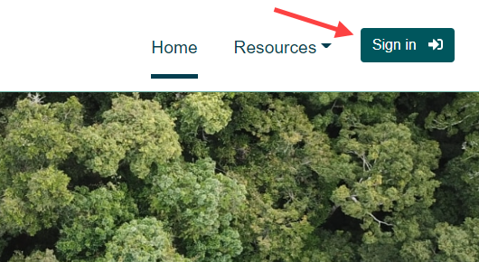

 

## TERN Data Services Code Examples

These examples allow you to download the CMRSET Actual Evapotranspiration product archive from the TERN Data Services Catalogue as <a href="https://www.cogeo.org/" target="_blank">Cloud-Optimized GeoTIFF's</a>.

The two implementations we provide here are:

1. **PowerShell:** a cross-platform task automation solution made up of a command-line shell, a scripting language, and a configuration management framework.
    <a href="https://docs.microsoft.com/en-us/powershell/scripting/overview?view=powershell-7.2" target="_blank">PowerShell</a> runs on Windows, Linux, and macOS.
    Windows PowerShell also comes installed <a href="https://docs.microsoft.com/en-us/powershell/scripting/windows-powershell/install/installing-windows-powershell?view=powershell-7.2" target="_blank">by default</a> in every Windows, starting with Windows 7 SP1 and Windows Server 2008 R2 SP1.

2. **Python:** an interpreted, object-oriented, high-level programming language with dynamic semantics.
    This makes <a href="https://en.wikipedia.org/wiki/Python_(programming_language)" target="_blank">Python</a> very attractive for Rapid Application Development, as well as for use as a scripting or glue language to connect existing components together. 
    Python also runs on Windows, Linux, and macOS.

### Script Parameters

The following parameters are configurable on all AET downloading scripts provided in this repository:

#### API_KEY
Your TERN API Key which is used to authenticate to TERN Data Services.  
*Further details on how to obtain an API key are provided below*.

#### PATH_OUT
The output folder where data will be saved.  
The full path where files will be saved to will be: \{ **PATH_OUT** } / \{ PRODUCT_CODE } / \{ YYYY } / \{ YYYY_MM_DD } /

#### PRODUCT_CODE
The CMRSET AET product code that will be downloaded.  
The default value is *CMRSET_LANDSAT_V2_2* which is the ***latest*** and ***recommended*** version.

#### START
The dataset start date to begin downloading data from (formatted as YYYY-MM-DD).

#### END
The dataset end date to finish downloading data on (formatted as YYYY-MM-DD).

#### TILES
The list of tile indicies you wish to download.  
The default value is a list containing all 12 tiles.
Indicies are shown in the figure below. i.e. if you are only interested in data for Victoria, you may use a list which contains the values 10 and 11.

### Generating an API Key

1. Firstly, please visit the TERN Accounts portal at (https://account.tern.org.au) and **Sign In**.

2. After singing in, in the **Sign In** dropdown menu, select the **API Keys** item.

3. Click **Create API key** in the left hand menu, and givie your key a **name**.

4. After generation the API key, you need to copy the key and store it in a secure place (Note: The API key is only displayed once in the API Key
Information page - and will not be shown or accessible after this - for security reasons)

### References

Guerschman, J.P., McVicar, T.R., Vleeshouwer, J., Van Niel, T.G., Peña-Arancibia, J.L. and Chen, Y. (2022) Estimating actual evapotranspiration at field-to-continent scales by calibrating the CMRSET algorithm with MODIS, VIIRS, Landsat and Sentinel-2 data. *Journal of Hydrology. 605, 127318*, <a href="https://doi.org/10.1016/j.jhydrol.2021.127318" target="_blank">https://doi.org/10.1016/j.jhydrol.2021.127318</a>

McVicar, T.R., Vleeshouwer, J., Van Niel, T.G., Guerschman, J.P., Peña-Arancibia, J.L. and Stenson, M.P. (2022) Generating a multi-decade gap-free high-resolution monthly actual evapotranspiration dataset for Australia using Landsat, MODIS and VIIRS data in the Google Earth Engine platform: Development and use cases. *Journal of Hydrology (In Preparation)*.
