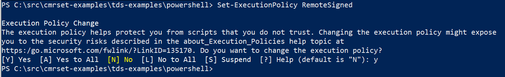

[](https://opensource.org/licenses/MIT)
[](https://data.tern.org.au/landscapes/aet/v2_2/) 


# Important Notes

To execute this script you will need to set the <a href="https://docs.microsoft.com/en-us/powershell/module/microsoft.powershell.security/set-executionpolicy?view=powershell-7.2" target="_blank">Execution Policy</a> for PowerShell.
To do this, you can run the following command from with PowerShell as **Administrator**:

```
Set-ExecutionPolicy RemoteSigned
```

You will then be prompted for confirmation where you will need to press **Y**.




### References

Guerschman, J.P., McVicar, T.R., Vleeshouwer, J., Van Niel, T.G., Peña-Arancibia, J.L. and Chen, Y. (2022) Estimating actual evapotranspiration at field-to-continent scales by calibrating the CMRSET algorithm with MODIS, VIIRS, Landsat and Sentinel-2 data. *Journal of Hydrology. 605, 127318*, <a href="https://doi.org/10.1016/j.jhydrol.2021.127318" target="_blank">https://doi.org/10.1016/j.jhydrol.2021.127318</a>

McVicar, T.R., Vleeshouwer, J., Van Niel, T.G., Guerschman, J.P., Peña-Arancibia, J.L. and Stenson, M.P. (2022) Generating a multi-decade gap-free high-resolution monthly actual evapotranspiration dataset for Australia using Landsat, MODIS and VIIRS data in the Google Earth Engine platform: Development and use cases. *Journal of Hydrology (In Preparation)*.
